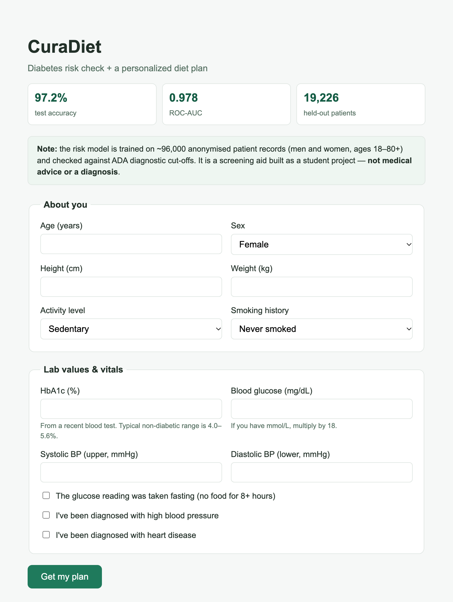
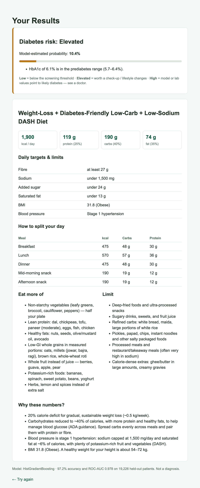
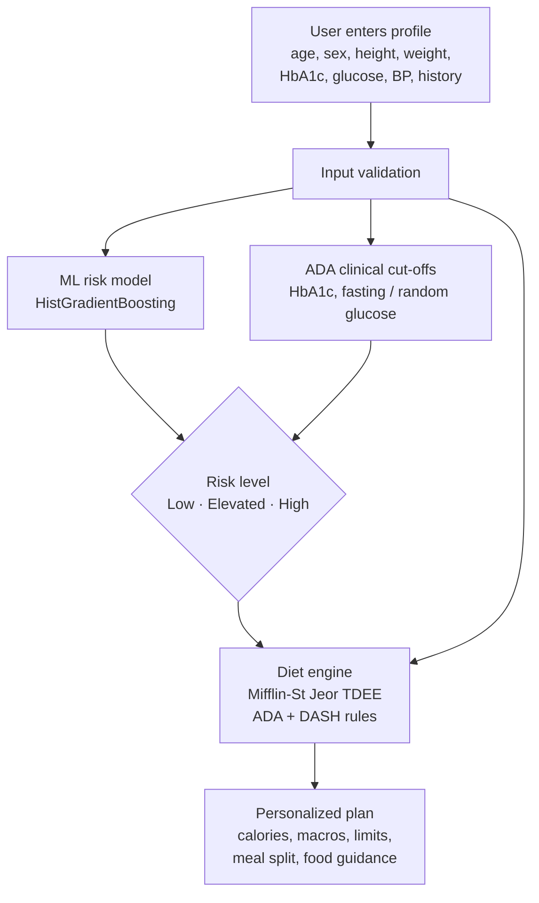

<div align="center">

# 🥗 CuraDiet

**Diabetes risk prediction + personalized diet planning**

An end-to-end machine learning web app that estimates a person's diabetes risk from their
labs and vitals, then builds a daily calorie, macro and meal plan grounded in clinical
guidelines (ADA, ACC/AHA, DASH).


</div>

---

## ✨ Highlights

| Feature | Details |
|---|---|
| 🎯 **97.2% accuracy** | on 19,226 held-out patients the model never saw during training |
| 📈 **0.978 ROC-AUC** | strong separation between diabetic and non-diabetic patients |
| 🩺 **Screening mode** | catches **84.7%** of diabetes cases while keeping 93.7% accuracy |
| 🛡️ **Clinical safety layer** | official ADA cut-offs for HbA1c and glucose are applied on top of the model |
| 🍽️ **Personalized plans** | calories, macros, fibre/sodium/sugar limits, a per-meal split and food suggestions |
| ✅ **Tested** | 34 pytest tests covering the diet rules, input validation, model quality and app routes |

## 📸 Screenshots

<table>
  <tr>
    <th>Health profile form</th>
    <th>Risk assessment & diet plan</th>
  </tr>
  <tr>
    <td valign="top"></td>
    <td valign="top"></td>
  </tr>
</table>

## ⚙️ How it works



1. **Risk model.** A HistGradientBoosting classifier trained on ~96,000 de-duplicated patient
   records. It uses age, sex, BMI, HbA1c, blood glucose, hypertension, heart disease and
   smoking history.
2. **Clinical safety layer.** ADA diagnostic thresholds (HbA1c ≥ 6.5%, fasting glucose
   ≥ 126 mg/dL, random glucose ≥ 200 mg/dL, plus the prediabetes ranges) are checked
   separately from the model. They can only *raise* the risk level, never lower it.
3. **Diet engine (deliberately rule-based, not ML).**
   - Daily energy needs come from the Mifflin-St Jeor equation × an activity factor.
   - A calorie deficit or surplus is applied based on BMI, never going below safe minimums.
   - The plan switches to lower-carb ADA-style macros when blood glucose needs managing.
   - Sodium and saturated fat are capped (DASH) when blood pressure is raised.
   - Every number comes with a plain-English *"why"*.

## 📊 Model performance

**Evaluation protocol.** I designed it to avoid data leakage, so the numbers are honest:
de-duplicate → stratified 80/20 split → compare models with 5-fold cross-validation on the
**training set only** → pick the winner by CV ROC-AUC → choose the screening threshold from
out-of-fold predictions → evaluate **once** on the untouched test set.

**Model comparison (5-fold CV on the training set)**

| Model | CV ROC-AUC | CV Accuracy |
|---|:---:|:---:|
| Logistic Regression | 0.962 | 95.9% |
| Random Forest | 0.970 | 97.0% |
| **HistGradientBoosting** ✅ | **0.979** | **97.1%** |

**Held-out test set (19,226 patients)**

| Operating point | Accuracy | Precision | Recall | Specificity | Balanced accuracy |
|---|:---:|:---:|:---:|:---:|:---:|
| **High risk** (p ≥ 0.50) | **97.2%** | 98.0% | 69.6% | 99.9% | 84.7% |
| **Elevated / screening** (p ≥ 0.16) | **93.7%** | 59.9% | 84.7% | 94.5% | 89.6% |

> **Why report more than accuracy?** Only 8.8% of patients in the data have diabetes, so a
> model that always answers "no diabetes" would already score 91.2%. ROC-AUC, recall and
> balanced accuracy show that the model actually finds diabetic patients. The two thresholds
> exist because a screening tool should miss as few real cases as possible: the "Elevated"
> band gives up some precision to catch many more true cases.

## 🔄 Version 2: what changed and why

The first version was trained on the **Pima Indians Diabetes Dataset** and reached about 74%
test accuracy. Running `python -m src.benchmark_pima` shows that this limit comes from the
data, not the model. Three very different models all plateau at the same level:

| Model (5-fold CV on Pima) | Accuracy | ROC-AUC |
|---|:---:|:---:|
| Logistic Regression | 77.2% | 0.837 |
| Random Forest | 76.6% | 0.835 |
| HistGradientBoosting | 75.6% | 0.821 |

Pima has only 768 rows, many missing values recorded as zeros, and covers only women aged
21+ from a single population. Version 2 moved to a much larger dataset that includes
**HbA1c**, the main blood-test marker for diabetes. That lifted accuracy from 74% to 97% and
removed the women-only limitation.

<details>
<summary><b>Bugs fixed from version 1</b></summary>

- **Crashes on bad input.** An empty or non-numeric field caused a 500 error. Every field is
  now validated, with clear messages, and the form keeps what the user typed.
- **Hard-coded relative paths.** The app only worked when started from the project folder.
  Paths now resolve from `src/config.py`.
- **Test-set leakage.** The "best" model used to be chosen by its test score. It is now
  chosen by cross-validation on the training data only.
- **Wrong blood-pressure categories.** 130/80 was labelled "Elevated". Categories now follow
  the 2017 ACC/AHA guideline.
- **Hidden made-up inputs.** Insulin, skin thickness and family history were silently filled
  with constants. The model now uses only values the user enters.
- **Unsafe calorie targets.** Minimum floors are now 1,200 kcal (women) and 1,500 kcal (men).
- **Model version drift.** The saved model records its scikit-learn version, and the app
  warns if the installed version differs.

</details>

## 🚀 Getting started

```bash
git clone https://github.com/harshchaudhari09/DIET-RECOMMENDATION-PLANNER.git
cd DIET-RECOMMENDATION-PLANNER
pip install -r requirements.txt
```

```bash
python app.py                  # open http://127.0.0.1:5000
```

A trained model is included in `models/`. To retrain it and run the tests:

```bash
python -m src.train_model      # about 15 seconds: trains, compares and saves the model + metrics
python -m pytest               # 34 tests
python -m src.benchmark_pima   # optional: reproduces the Pima accuracy ceiling
```

### ☁️ Deploying

The repo includes a [`render.yaml`](render.yaml) blueprint, so it deploys to
[Render](https://render.com)'s free tier in a few clicks:

[](https://render.com/deploy?repo=https://github.com/harshchaudhari09/DIET-RECOMMENDATION-PLANNER)

It runs under `gunicorn`, and `/healthz` is the health-check endpoint. On the free tier
the app sleeps after about 15 minutes without traffic, so the first visit afterwards
takes around a minute to wake it up.

## 🗂️ Project structure

```
├── app.py                       # Flask app
├── render.yaml                  # Render deployment blueprint
├── src/
│   ├── config.py                # paths, feature lists, valid input ranges
│   ├── data.py                  # loading + cleaning (de-duplication)
│   ├── train_model.py           # CV model comparison, thresholds, test evaluation
│   ├── risk.py                  # model inference + ADA clinical cut-offs
│   ├── diet_rules.py            # calorie/macro engine (ADA, ACC/AHA, DASH)
│   ├── validation.py            # form parsing + validation
│   └── benchmark_pima.py        # shows the v1 dataset's accuracy ceiling
├── data/
│   ├── diabetes_prediction_dataset.csv   # ~100k records (training data)
│   └── pima_diabetes.csv                 # v1 dataset, kept for the benchmark
├── models/                      # trained model + metrics.json
├── templates/ · static/         # HTML templates and CSS
├── tests/                       # pytest suite
└── docs/screenshots/            # images used in this README
```

## ⚠️ Limitations

- The training data is a public Kaggle dataset with limited documentation about how it was
  collected. Treat the results as a demonstration, not a clinically validated tool.
- The model needs an **HbA1c** value from a blood test. Without it, performance drops sharply
  (ROC-AUC about 0.93).
- At the 0.5 threshold, recall is 70%. That is why the app adds a lower screening threshold and
  hard ADA cut-offs instead of giving a single yes/no answer.
- The diet engine encodes general guidelines, not individualized medical advice.

## 🛣️ Roadmap

- [ ] Probability calibration and a reliability plot
- [ ] SHAP explanations showing which factors drove each prediction
- [ ] Save submissions to track progress over time

## 📚 Data & references

- [Diabetes Prediction Dataset](https://www.kaggle.com/datasets/iammustafatz/diabetes-prediction-dataset) (Kaggle): main training data
- [Pima Indians Diabetes Dataset](https://github.com/jbrownlee/Datasets) (NIDDK): v1 data, used for the benchmark
- American Diabetes Association, *Standards of Care in Diabetes*: diagnostic thresholds and carbohydrate guidance
- 2017 ACC/AHA Blood Pressure Guideline: blood-pressure categories
- NIH NHLBI, *DASH Eating Plan*: sodium and dietary pattern for raised blood pressure
- Mifflin MD, St Jeor ST et al. (1990): resting energy expenditure equation

## ⚕️ Disclaimer

CuraDiet is an educational project. It is **not** a medical device and does not provide a
diagnosis or medical advice. Always consult a qualified healthcare professional about your health.

---

<div align="center">
Built by <a href="https://github.com/harshchaudhari09">@harshchaudhari09</a>
</div>
